# 开发环境

By: [:material-github: wu-kan](https://github.com/wu-kan)、[:material-github: howardlau1999](https://github.com/howardlau1999)

本项目经过测试且可用的操作系统为：

- Windows 10
- Debian 11
- Debian 11, Windows Subsystem for Linux (WSL)

!!! warning "macOS 无法烧板"
    除了 Vivado 之外，所有工具都可以在 macOS 上运行，也即可以顺利完成软件测试以及波形仿真。但由于 **Vivado 无法在 macOS 上安装**，所以如果你使用的是 macOS 并且**需要进行烧板实验**，请通过虚拟机或使用其他设备等方式使用上述的操作系统进行实验。

我们提供两种风格的开发环境配置方案：

1. 对于喜欢使用 IDE 集成环境的同学，推荐使用 Windows 配置方法。
2. 对于喜欢使用终端+代码编辑器组合的同学，推荐使用 Linux/WSL 配置方法，或使用我们准备好的 Docker 环境。

## Docker 配置方法

!!!tips "如果你不了解什么是 Docker"
    如果你不知道什么是 Docker，可以直接跳过这一节，按照下面的 Windows 或 Linux/WSL 配置方法在本机进行配置。

该方法适用于 Windows、Linux 和 macOS 系统。

首先到 [Docker 官方网站](https://docs.docker.com/engine/install/#supported-platforms) 选择并下载你使用的操作系统所对应的安装包，按照安装指南配置好 Docker。Docker 环境中含有 Scala 开发环境以及 Verilator 仿真器，但不包含 Vivado。如果你不需要烧板，那么使用 Docker 环境就可以完成所有实验以及软件测试了。

之后，只需要运行

```bash
docker run -it --rm howardlau1999/yatcpu
sbt test
```

Docker 会自动下载我们准备好的镜像并运行容器。如果成功执行，你会看到类似这样的输出。

```
[success] Total time: 385 s (06:25), completed Dec 15, 2021, 8:45:25 PM
```

Docker 中的 YatCPU 代码可能不是最新版，且容器结束运行之后所有修改都将丢失，如果你需要完成实验，需要先将代码仓库克隆到本机，然后在运行 Docker 容器时挂载本机目录：

```
git clone --recursive https://github.com/howardlau1999/yatcpu
docker run -it --rm -v yatcpu:/root/yatcpu howardlau1999/yatcpu
```

按照这种方法在容器中所做的修改将保存到本机文件夹，反之同理。

## Windows 配置方法

### 安装 Intellij IDEA 和 Scala 插件

使用 Intellij IDEA 配置开发环境比较简单，而且也经过了测试，所以，我们推荐在 Windows 上直接使用 Intellij IDEA 来设置开发环境。

可以先[安装 JetBrains Toolbox](https://www.jetbrains.com/toolbox-app/)，然后通过 JetBrains Toolbox 一键安装 Intellij IDEA Community Edition。

或者[到 JetBrains 官方网站下载 Intellij IDEA](https://www.jetbrains.com/idea/download/#section=windows)，下载免费的 Commnunity Edition 即可。

打开 Intellij IDEA，选择 “Get from VCS”，按照下图填入信息：

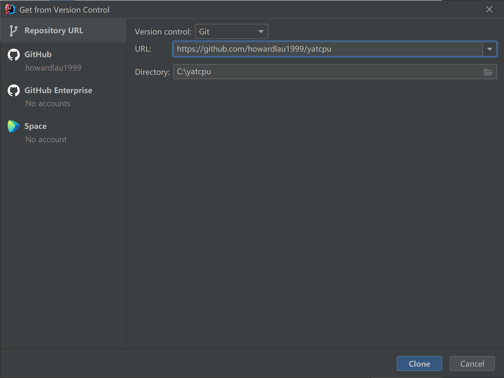

其中 URL 填 `https://github.com/howardlau1999/yatcpu`，Directory 可以填一个你喜欢的路径，要记得自己存在哪，后续命令行要使用到这个路径，之后点击 “Clone”，就会自动下载项目代码仓库并打开了。

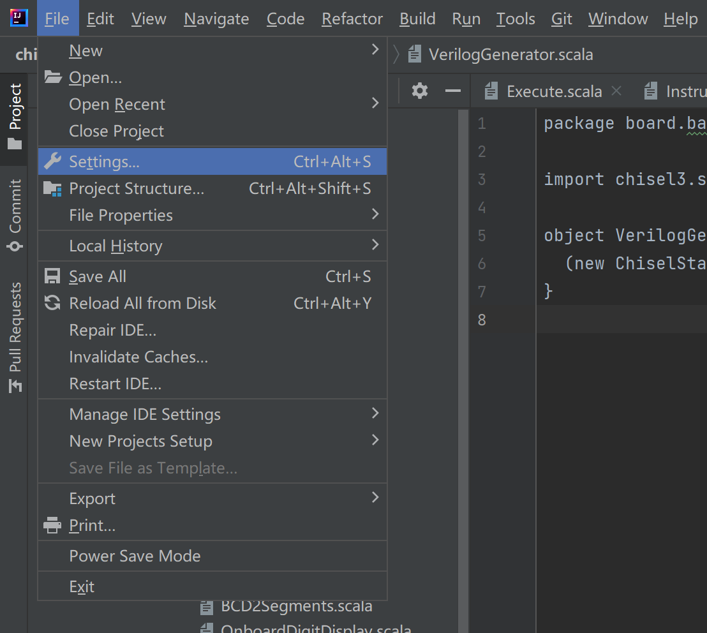

打开 IDE 后，按快捷键 ++ctrl+alt+s++ 打开设置。

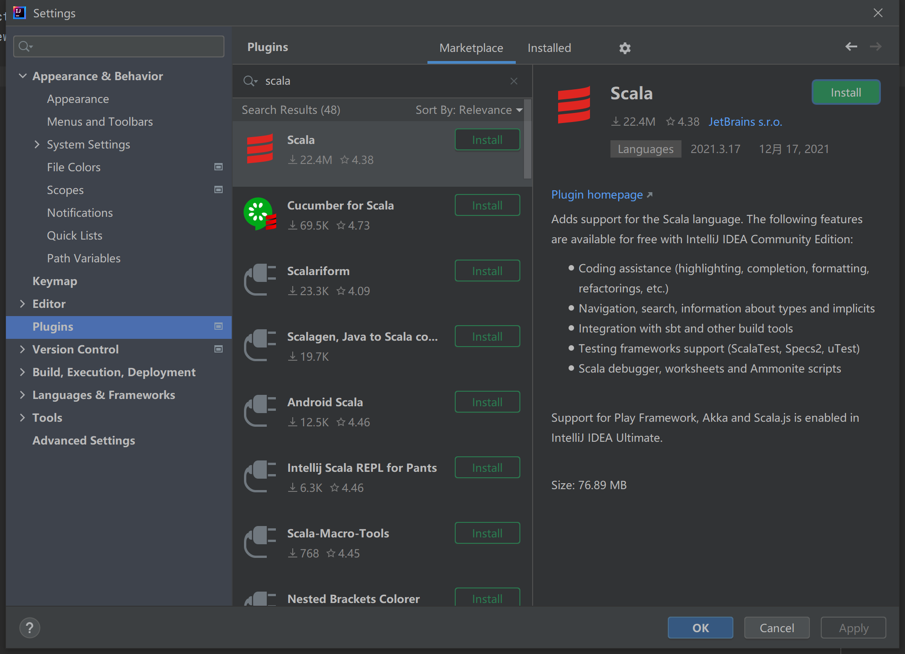

选择 Plugins，搜索并安装 Scala 插件。

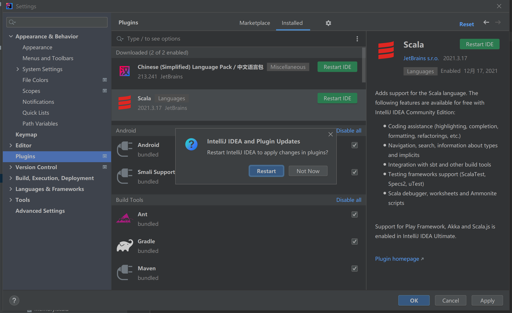

你还可以顺便安装一个中文插件。安装完成后，点击 Restart IDE 重启 IDE。

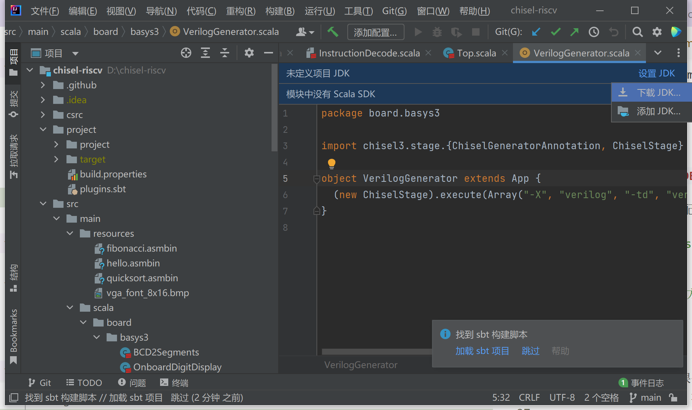

点击图上的设置 JDK，选择下载 JDK。

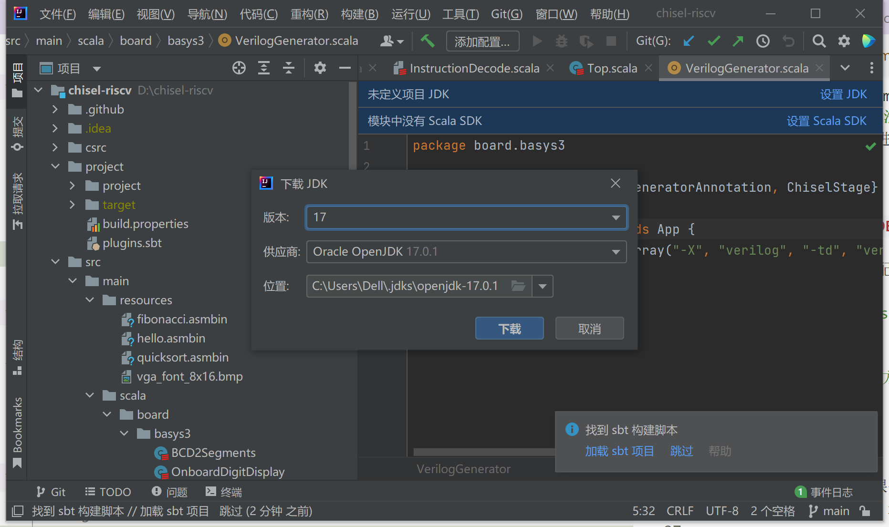

下载。如果没有弹出提示，请展开下方帮助按照指引手动下载 JDK。

???tips "手动下载 JDK"
    如果没有弹出提示，按 ++ctrl+alt+shift+s++ 打开设置，选择左边的 Project（项目）选项，然后点击 JDK 下拉菜单，移动到添加 JDK 上，选择下载 JDK。
    
    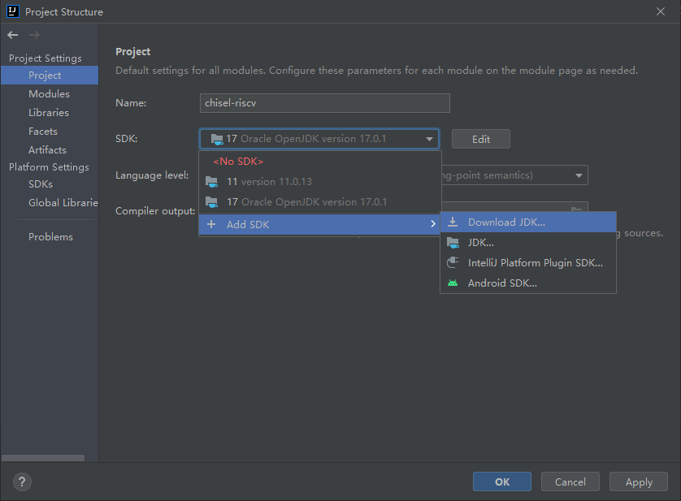
    
    之后在弹出的对话框中选择需要下载的版本，点击下载即可。
    
    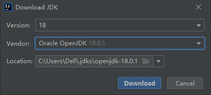

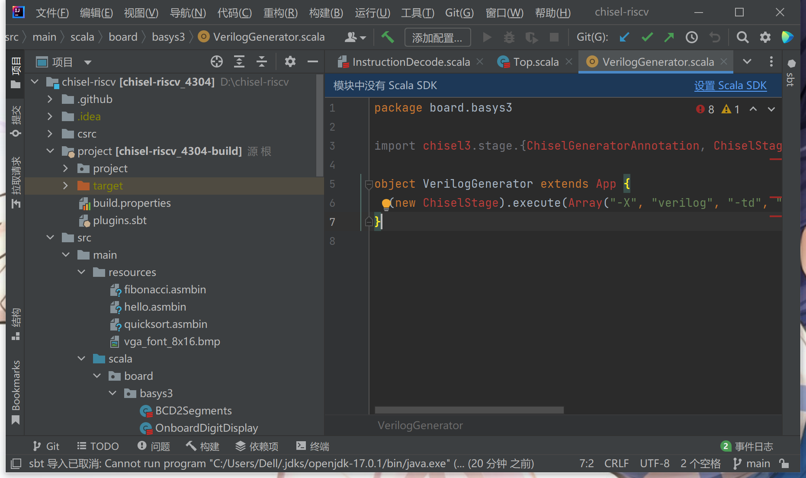

再选择设置 Scala SDK。

???tips "手动下载 Scala SDK"
    如果没有如果没有弹出提示，按 ++ctrl+alt+shift+s++ 打开设置，选择左边的 Global Libraries（全局库）选项，点击 + 号，选择 Scala SDK，在弹出的窗口选择下载，选择需要的版本之后点确定开始下载，然后在列表里选中刚刚下载好的版本选择添加即可。

    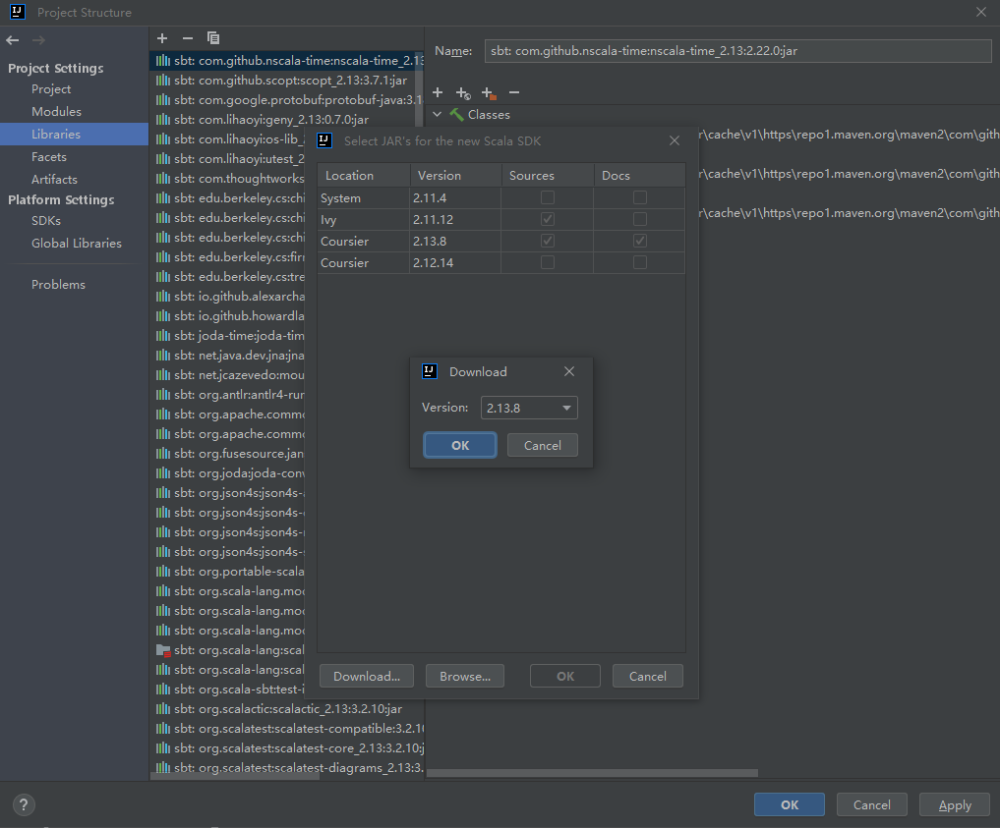

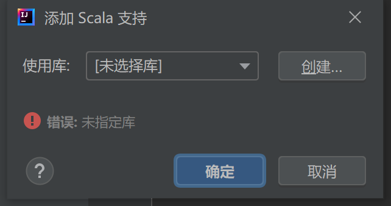

选择创建。

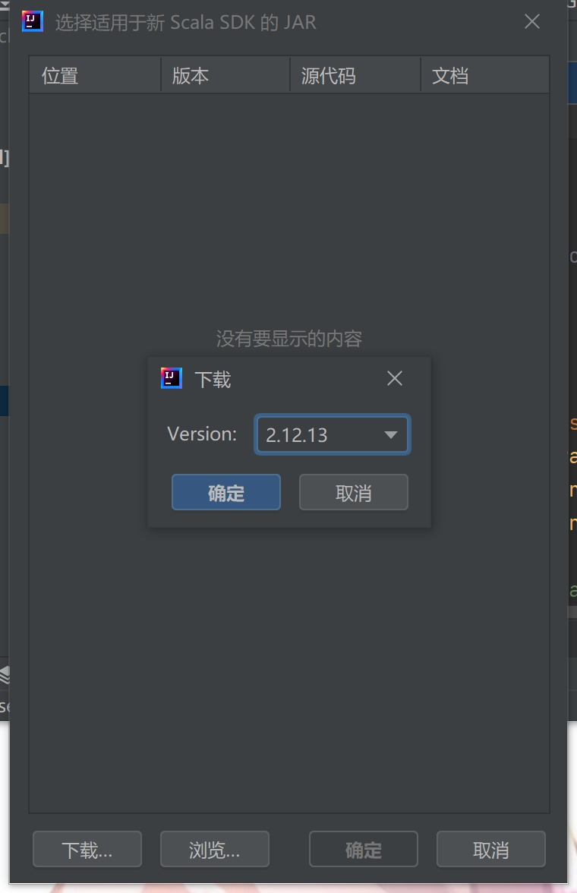

点下载，在跳出来的窗口中选择我们项目使用的 2.13.8 版本。

回到“添加 Scala 支持”窗口，在“使用库”中选中我们刚才下载的版本，点击确定。最后记得点击“加载 sbt 项目”加载项目配置。

大功告成！

### 安装 Vivado

中山大学组成原理实验课使用的 [Basys3](https://www.stepfpga.com/doc/_media/basys3_ss.pdf) 实验板型号为 XC7A35T，需要 Xilinx 的工具进行综合实现以及烧板。这里安装 `Vitis` 即可，不需要许可或激活许可密钥。

经过测试且可用的 Vivado 版本为 2020.1。更新或更旧的版本理论上可以使用，但没有经过测试。

安装包体积较大，**推荐使用带断点续传功能的下载工具如迅雷、Free Download Manager 下载**。

如果你在**中山大学校园网内**下载 Vivado 2020.1 安装包，可以使用我们提供的镜像：[点此下载](https://mirrors.matrix.moe/software/Xilinx/Xilinx_Unified_2020.1_0602_1208.tar.gz)。

也可以在 Xilinx 的官网下载：[点击跳转](https://china.xilinx.com/support/download/index.html/content/xilinx/zh/downloadNav/vivado-design-tools/archive.html)。

!!! warning "预留足够的硬盘空间"
    Vivado 2020.1 安装包体积较大，约为 36 GB，且后续安装也要使用大量硬盘空间。请预留好**至少 100 GB 的硬盘空间**。

### 安装 Clang 编译器

如果你**没有安装过 Visual Studio**，[点此下载 Visual Studio Build Tools 安装包](https://aka.ms/vs/17/release/vs_BuildTools.exe)并运行，在“工作负荷”标签页选择“使用 C++ 的桌面开发”，并在右侧“安装详细信息”中的“可选”列表里，勾选“适用于 Windows 的 C++ Clang 工具”，之后点击安装即可。

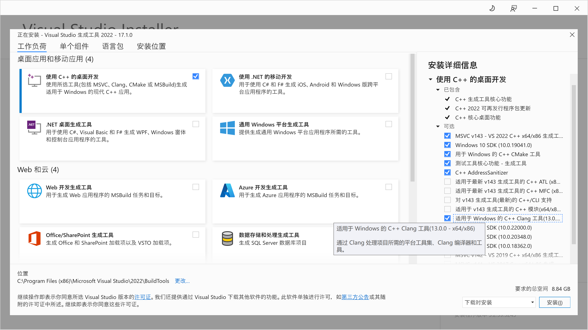

如果**已经安装过 Visual Studio**，在开始菜单中搜索“Visual Studio Installer”，然后点击“修改”，选中“工作负荷”标签页里的“使用 C++ 的桌面开发”，并在右侧“安装详细信息”中的“可选”列表里，勾选“适用于 Windows 的 C++ Clang 工具”，之后点击“安装”即可。

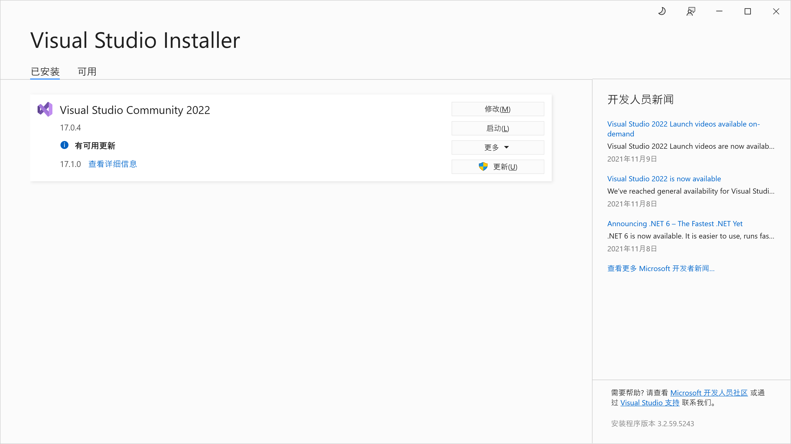

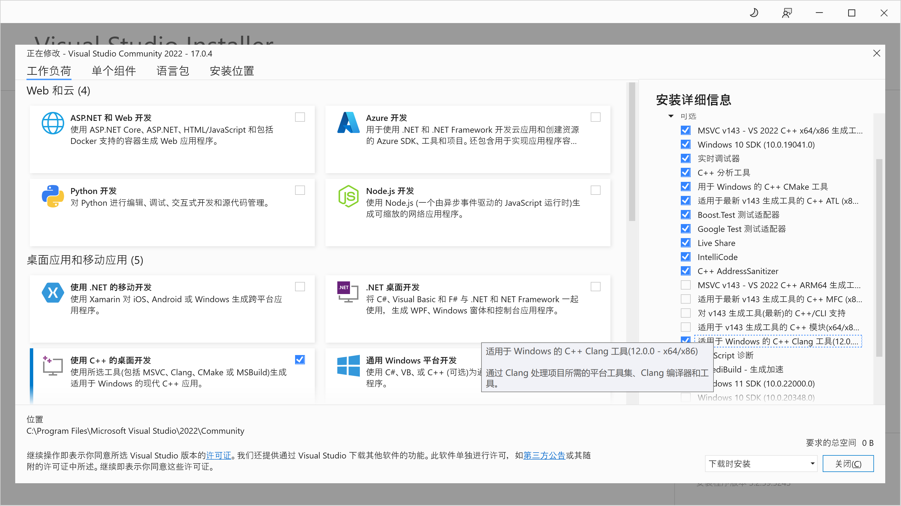

安装完成后，在开始菜单中搜索“Developer Command Prompt”，然后运行，应该会弹出一个命令行窗口显示以下信息（以下为已安装 Visual Studio 的样例）：

```cmd
**********************************************************************
** Visual Studio 2022 Developer Command Prompt v17.0.4
** Copyright (c) 2021 Microsoft Corporation
**********************************************************************

C:\Program Files\Microsoft Visual Studio\2022\Community>
```

之后，`cd` 到你克隆到本地的代码仓库的中的 `csrc` 文件夹，例如 `C:\yatcpu\csrc`，如果你的项目文件保存在别的盘符（例如 `D:`），要先输入 `D:` 按回车后再执行 `cd` 命令。然后运行 `.\build.bat` 脚本：

```cmd
C:\Program Files\Microsoft Visual Studio\2022\Community>cd C:\yatcpu\csrc
C:\yatcpu\csrc>.\build.bat
```

如果正常运行，应该看到以下输出：

```cmd
C:\yatcpu\csrc>rmdir /Q /S build
系统找不到指定的文件。

C:\yatcpu\csrc>cmake -DCMAKE_TOOLCHAIN_FILE=toolchain.cmake -G"NMake Makefiles" -B build .
-- The C compiler identification is Clang 12.0.0
-- The CXX compiler identification is Clang 12.0.0
-- The ASM compiler identification is Clang
-- Found assembler: C:/Program Files/Microsoft Visual Studio/2022/Community/VC/Tools/Llvm/x64/bin/clang.exe
-- Detecting C compiler ABI info
-- Detecting C compiler ABI info - done
-- Check for working C compiler: C:/Program Files/Microsoft Visual Studio/2022/Community/VC/Tools/Llvm/x64/bin/clang.exe - skipped
-- Detecting C compile features
-- Detecting C compile features - done
-- Detecting CXX compiler ABI info
-- Detecting CXX compiler ABI info - done
-- Check for working CXX compiler: C:/Program Files/Microsoft Visual Studio/2022/Community/VC/Tools/Llvm/x64/bin/clang++.exe - skipped
-- Detecting CXX compile features
-- Detecting CXX compile features - done
-- Configuring done
-- Generating done
-- Build files have been written to: C:/yatcpu/csrc/build

C:\yatcpu\csrc>cmake --build build
Scanning dependencies of target tetris
[  6%] Building ASM object CMakeFiles/tetris.dir/init.S.obj
[ 12%] Building C object CMakeFiles/tetris.dir/tetris.c.obj
[ 18%] Linking C executable tetris
[ 18%] Built target tetris
Scanning dependencies of target hello
[ 25%] Building ASM object CMakeFiles/hello.dir/init.S.obj
[ 31%] Building C object CMakeFiles/hello.dir/hello.c.obj
[ 37%] Linking C executable hello
[ 37%] Built target hello
Scanning dependencies of target fibonacci
[ 43%] Building ASM object CMakeFiles/fibonacci.dir/init.S.obj
[ 50%] Building C object CMakeFiles/fibonacci.dir/fibonacci.c.obj
[ 56%] Linking C executable fibonacci
[ 56%] Built target fibonacci
Scanning dependencies of target quicksort
[ 62%] Building ASM object CMakeFiles/quicksort.dir/init.S.obj
[ 68%] Building C object CMakeFiles/quicksort.dir/quicksort.c.obj
[ 75%] Linking C executable quicksort
[ 75%] Built target quicksort
Scanning dependencies of target mmio
[ 81%] Building ASM object CMakeFiles/mmio.dir/mmio.S.obj
[ 87%] Linking ASM executable mmio
[ 87%] Built target mmio
Scanning dependencies of target sb
[ 93%] Building ASM object CMakeFiles/sb.dir/sb.S.obj
[100%] Linking ASM executable sb
[100%] Built target sb
```

### 安装 Verilator

Chisel 3 自带的仿真器速度较慢，Verilator 通过将 Verilog 代码编译为 C++ 代码加速仿真。目前，Verilator 仅原生支持 Linux 系统，但我们可以使用 MSYS2 在 Windows 上使用 Verilator。

首先需要安装 MSYS2，到[官方网站下载最新的安装包](https://www.msys2.org/)，运行安装程序。注意**安装路径不能含有中文和空格**，建议直接安装在默认的 `C:\msys64` 下。安装完成之后，按 ++win+r++，输入 `cmd` 回车，打开命令提示符，运行：

```cmd
C:\msys64\usr\bin\bash.exe -l -c ^
"pacman -Sy --noconfirm --needed ^
base-devel mingw-w64-x86_64-toolchain ^
git flex mingw-w64-x86_64-cmake ^
mingw-w64-x86_64-verilator"
```

该命令将安装 Verilator 以及其依赖。安装完成后，还需要设置系统环境变量，在开始菜单搜索“环境变量”，打开“编辑系统环境变量”，在弹出的对话框点击“环境变量”，双击用户变量中的“Path”，点击“新建”，在**最后**添加两行：

- `C:\msys64\usr\bin`
- `C:\msys64\mingw64\bin`

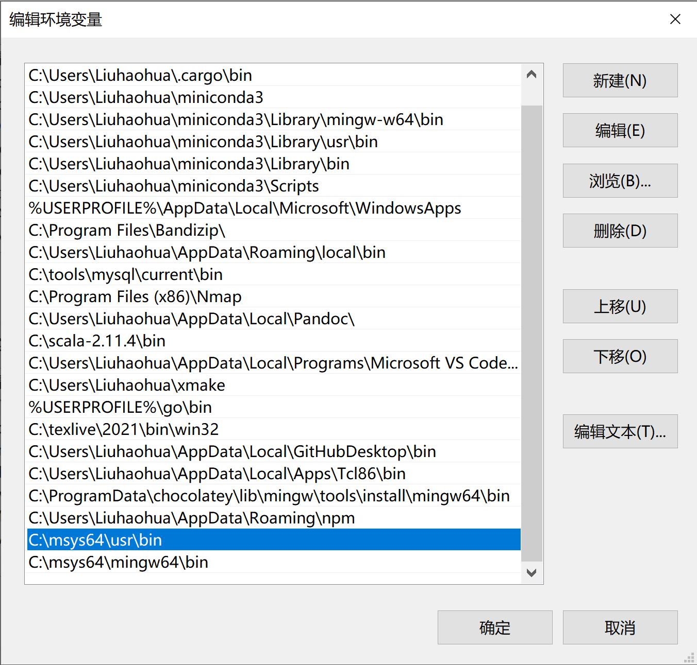

之后一路点“确定”关掉所有对话框，并关掉刚刚打开的命令提示符。然后重新打开命令提示符，运行 `verilator_bin --version`，如果配置正确，应当看到类似的输出：

```
C:\>verilator_bin --version
Verilator 4.218 2022-01-17 rev UNKNOWN.REV
```

之后，运行仿真测试的时候，测试框架将自动寻找 Verilator 并用来加速。

## Linux/WSL1 配置方法

下面介绍如何在 Linux 或 WSL(Windows Subsystem for Linux) 环境中搭建本实验的开发环境。[这里](https://liuhaohua.com/server-programming-guide/appendix/build-env/)给出搭建相关环境的一个参照。

这里假设你使用的 Linux 或 WSL 系统是 Debian 11。对于使用其他 Linux 系统的同学，操作是类似的，相信你有足够的能力参考下面的指令搭建环境。

### 安装必要工具

本实验将会使用到以下工具，除 sbt 外，可以通过下面提供的命令一键安装：

```bash
sudo apt install -y git \
    clang \
    make \
    gnupg \
    scala \
    libtinfo5 \
    coreutils \
    cmake \
    llvm \
    lld 
```

| 名称                    | 说明                                 |
| ----------------------- | ------------------------------------ |
| git                     | 代码版本管理工具                     |
| clang, lld              | 用于编译生成 RISC-V 可执行二进制文件 |
| llvm                    | 用于编辑和查看二进制文件             |
| make                    | 用于执行 Makefile                    |
| cmake                   | 用于执行 CMakeLists.txt              |
| gnupg                   | 签名验证工具                         |
| scala                   | 本项目的语言编译器                   |
| sbt                     | Scala 包管理器                       |
| libtinfo5               | Vivado 启动依赖                      |
| md5sum                  | 安装包校验工具                       |

### 安装 sbt 包管理器

[sbt](https://packages.debian.org/sid/sbt) 目前仍然在 Debian 的[不稳定](https://www.debian.org/releases/sid/)版本中。对于不希望使用 sid 系统的同学，可以按照[文档](https://www.scala-sbt.org/1.x/docs/zh-cn/Installing-sbt-on-Linux.html#Ubuntu%E5%92%8C%E5%85%B6%E4%BB%96%E5%9F%BA%E4%BA%8EDebian%E7%9A%84%E5%8F%91%E8%A1%8C%E7%89%88)的指示下载安装。

```bash
curl -fsSL "https://keyserver.ubuntu.com/pks/lookup?op=get&\
search=0x2EE0EA64E40A89B84B2DF73499E82A75642AC823" | \
    sudo gpg --dearmor -o /usr/share/keyrings/scalasbt-archive-keyring.gpg
echo "deb [signed-by=/usr/share/keyrings/scalasbt-archive-keyring.gpg] \
  https://repo.scala-sbt.org/scalasbt/debian all main" | sudo tee \
    /etc/apt/sources.list.d/sbt.list
echo "deb [signed-by=/usr/share/keyrings/scalasbt-archive-keyring.gpg] \
  https://repo.scala-sbt.org/scalasbt/debian /" | sudo tee \
    /etc/apt/sources.list.d/sbt_old.list
sudo apt update
sudo apt install sbt
```

### 安装 Vivado

中山大学组成原理实验课使用的 [Basys3](https://www.stepfpga.com/doc/_media/basys3_ss.pdf) 实验板型号为 XC7A35T，需要 Xilinx 的工具进行综合实现以及烧板。这里安装 `Vitis` 即可，不需要许可或激活许可密钥。

经过测试且可用的 Vivado 版本为 2020.1。更新或更旧的版本理论上可以使用，但没有经过测试。

中山大学校园网内下载 Vivado 2020.1 安装包，可以使用我们提供的镜像。

!!! warning "预留足够的硬盘空间"
    Vivado 2020.1 安装包体积较大，约为 36 GB，且后续安装也要使用大量硬盘空间。请预留好**至少 100 GB 的硬盘空间**。

下面是使用 `curl` 下载校园网安装包镜像的命令，你也可以使用其他方式下载。

```bash
# 下载
curl -O https://mirrors.matrix.moe/software/Xilinx/Xilinx_Unified_2020.1_0602_1208.tar.gz
# 也可以在 Xilinx 的官网下载
# https://china.xilinx.com/support/download/index.html/content/xilinx/zh/downloadNav/vivado-design-tools/archive.html
```

由于文件较大，为了校验传输过程中是否发生错误，请在下载完成后验证安装包的 MD5 值。使用以下命令计算文件的 MD5 值：

```bash
md5sum Xilinx_Unified_2020.1_0602_1208.tar.gz
```

命令应当输出以下内容：

```bash
b018f7b331ab0446137756156ff944d9  Xilinx_Unified_2020.1_0602_1208.tar.gz
```

如果不一致，请重新下载。校验通过后，使用下面的命令解压安装包并生成安装配置文件：

```bash
tar -zxf Xilinx_Unified_2020.1_0602_1208.tar.gz
cd Xilinx_Unified_2020.1_0602_1208
./xsetup -b ConfigGen
```

输入 `1`，会产生一个默认配置文件 `~/.Xilinx/install_config.txt`。

随后再次执行下述指令，安装 `Vitis`。

```bash
./xsetup -a XilinxEULA,3rdPartyEULA,WebTalkTerms -b Install \
    -c ~/.Xilinx/install_config.txt -l ~/Xilinx
```

其中 `~/Xilinx` 是安装目录，可以自行定义。

### 测试 Clang 编译器

`cd` 到仓库中的 `csrc` 目录，运行 `./build.sh` 脚本，一切正常的话应当看到如下输出：

```bash
~/chisel-riscv/csrc$ ./build.sh
-- The C compiler identification is Clang 11.0.1
-- The CXX compiler identification is Clang 11.0.1
-- The ASM compiler identification is Clang
-- Found assembler: /usr/bin/clang
-- Detecting C compiler ABI info
-- Detecting C compiler ABI info - done
-- Check for working C compiler: /usr/bin/clang - skipped
-- Detecting C compile features
-- Detecting C compile features - done
-- Detecting CXX compiler ABI info
-- Detecting CXX compiler ABI info - done
-- Check for working CXX compiler: /usr/bin/clang++ - skipped
-- Detecting CXX compile features
-- Detecting CXX compile features - done
-- Configuring done
-- Generating done
-- Build files have been written to: /mnt/c/Users/Liuhaohua/Desktop/chisel-riscv/csrc/build
Scanning dependencies of target prelude
[  7%] Building ASM object CMakeFiles/prelude.dir/init.S.obj
[ 14%] Linking ASM static library libprelude.a
[ 14%] Built target prelude
Scanning dependencies of target fibonacci
Scanning dependencies of target hello
Scanning dependencies of target mmio
Scanning dependencies of target quicksort
Scanning dependencies of target tetris
Scanning dependencies of target sb
[ 21%] Building ASM object CMakeFiles/mmio.dir/mmio.S.obj
[ 57%] Building C object CMakeFiles/quicksort.dir/quicksort.c.obj
[ 57%] Building ASM object CMakeFiles/sb.dir/sb.S.obj
[ 57%] Building C object CMakeFiles/tetris.dir/tetris.c.obj
[ 57%] Building C object CMakeFiles/fibonacci.dir/fibonacci.c.obj
[ 57%] Building C object CMakeFiles/hello.dir/hello.c.obj
[ 78%] Linking C executable quicksort
[ 78%] Linking C executable fibonacci
[ 78%] Linking C executable tetris
[100%] Linking ASM executable sb
[100%] Linking C executable hello
[100%] Linking ASM executable mmio
[100%] Built target quicksort
[100%] Built target tetris
[100%] Built target fibonacci
[100%] Built target sb
[100%] Built target mmio
[100%] Built target hello
```

### 安装 Verilator

Verilator 是一款将 Verilog 代码编译到 C++ 代码以加速模拟过程的软件，目前仅支持在 Linux/macOS 环境下运行。而 Chisel 3 自带的模拟软件较慢，对于后期需要 CPU 运行较大的程序时，测试过程可能会很慢。对于大型的测试，测试程序会在 `PATH` 目录中寻找 Verilator 以加速测试过程，提高迭代效率。

可以直接通过 apt 安装：

```bash
sudo apt install verilator
```

或者使用 Verilator 推荐的安装方式，从源码安装：

```bash
cd $HOME
sudo apt-get install git perl python3 make autoconf g++ \
    flex bison ccache libgoogle-perftools-dev numactl perl-doc
git clone --depth 1 -b stable https://github.com/verilator/verilator
cd verilator
autoconf
./configure
make -j `nproc`
sudo make install
```

???+tips "修改安装路径"
    如果不想全局安装，可以在 `./configure` 后加参数 `--prefix=/path/to/install`，指定安装路径，且在后续测试时，需要将安装路径添加到 `PATH` 环境变量，以便测试程序可以找到 Verilator 可执行程序。

命令执行完毕后，可以执行命令 `verilator --version` 测试安装是否成功。如果安装无误，应当看到如下输出（版本号可能不同）：

```
Verilator 4.219 devel rev UNKNOWN.REV (mod)
```

之后，运行仿真测试的时候，测试框架将自动寻找 Verilator 并用来加速。

## macOS 配置指南

建议使用 Homebrew 包管理器，执行：

```bash
brew install llvm cmake verilator sbt
```
