# 硬件调试

在烧板后，可能会出现硬件运行和软件模拟不一致的情况。这时候可以使用硬件调试的方式来排查问题。硬件调试需要占用一定的板上资源，使用 Vivado 提供的 Integrated Logic Analyzer（ILA）模块来实现。

在生成项目文件后，双击打开 `.xpr` 文件，启动 Vivado。在 Vivado 中，点击 "Create Block Design" 按钮，新建一个 Block Design。（Pynq Z1 开发板对应的项目已经有 Block Design，直接点击 "Open Block Design" 按钮即可，也不需要添加顶层模块，脚本已经添加并连接好了）

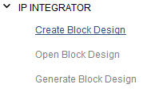

然后，将 Sources 中的 Top 模块拖拽到 Block Design 中，运行 Run Block Automation 和 Run Connection Automation，将 Top 模块自动连接起来。之后，右键想要观察波形的信号，右键引脚，选择 Debug，之后再运行一次 Run Connection Automation，即可自动添加 ILA 模块并连接。

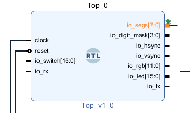

信号采样窗口大小受限于硬件资源，并且最大值是在 IP 核中设置的，需要在 Block Design 中，双击 ILA 核：

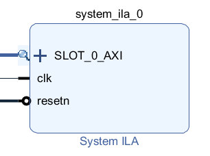

在弹出的设置窗口中，可以设置采样数量和比较器数量：

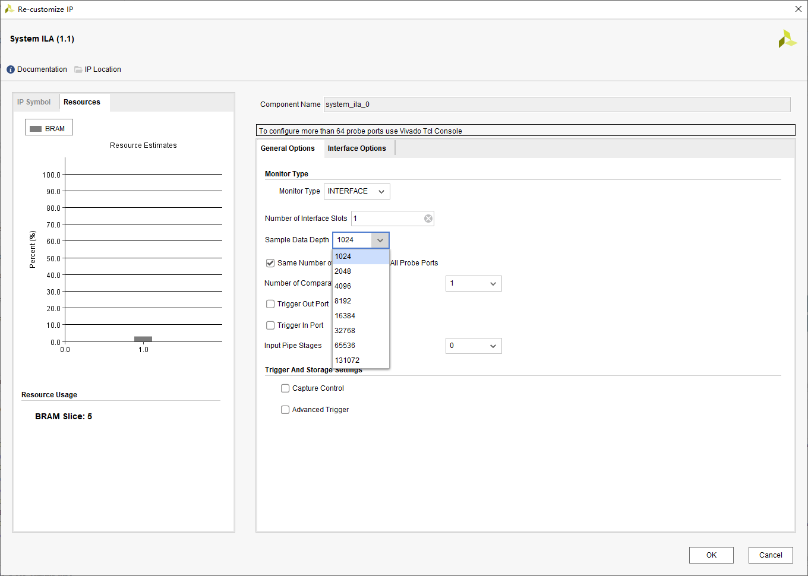

窗口的左边是预计消耗的硬件资源，如果消耗过多硬件资源可能会导致生成比特流失败，此时需要减少采样数量或者比较器数量。

之后右键 Sources 中的 Block Design，运行 Create HDL Wrapper，创建好对应的顶层模块后，按照正常流程生成比特流并烧入到开发板上。（Pynq Z1 也已经创建好，无需操作）

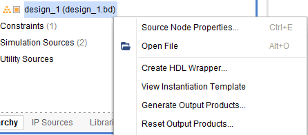

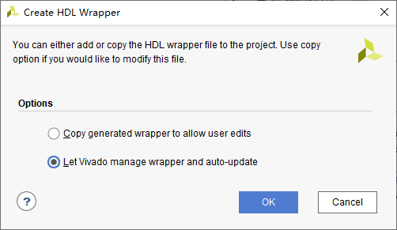

在 Program Device 对话框中，应该可以看到 Debug probe files 中有自动填入的 `.ltx` 文件。

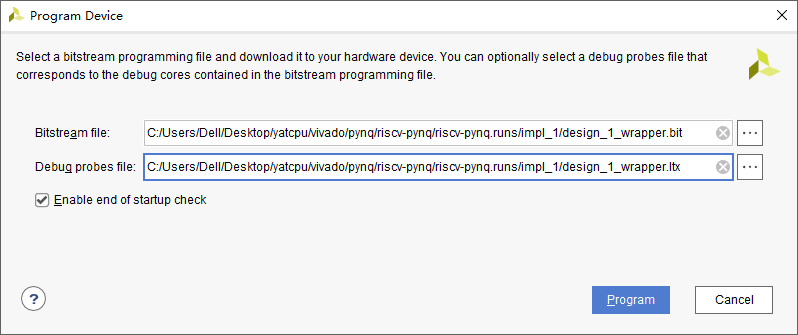

在烧板后，在 Hardware Manager 中，点击 Refresh Device，可以看到界面中自动检测到了 ILA 调试核，并打开了波形调试界面。

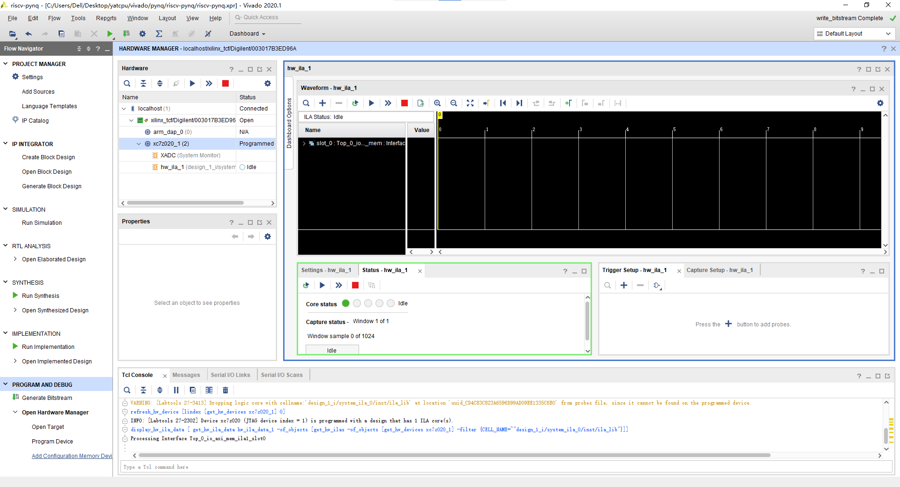

由于硬件资源有限，ILA 无法保存所有的波形，只能保存一定时间窗口内的若干采样。为了能够捕获我们需要调试的信号，需要先添加触发器，然后在触发器上设置触发条件。例如我们想调试 AXI 总线，可以点击加号，添加我们感兴趣的信号，然后设置触发条件。触发器的数量受限于 IP 核的设置。

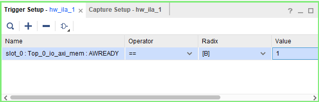

如图，我们设置了当 `AWREADY` 信号为 1 的时候触发。之后，点击一个三角的按钮，即进入触发模式，当条件满足的时候，窗口就会显示触发点前后的时间窗口中的波形数据。

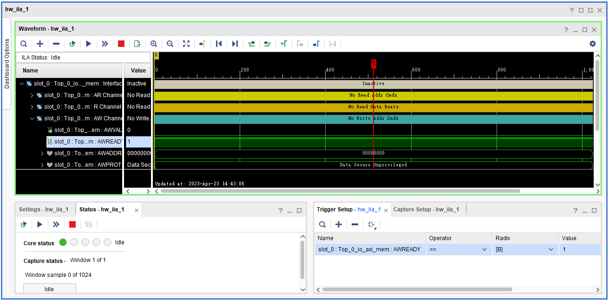

Vivado 会自动识别一些规范的信号，例如 AXI 总线的信号，并进一步分组分析，可以点击展开来查看原始数据。

点击 `>>` 也可以马上采样一次。

如果需要调整窗口大小和触发点位于窗口中的位置，可以在 `Settings` 中的 `Capture Mode Settings` 设置：

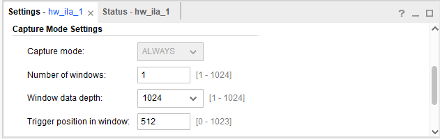

需要注意采样窗口的大小的最大值受限于 IP 核的设置。