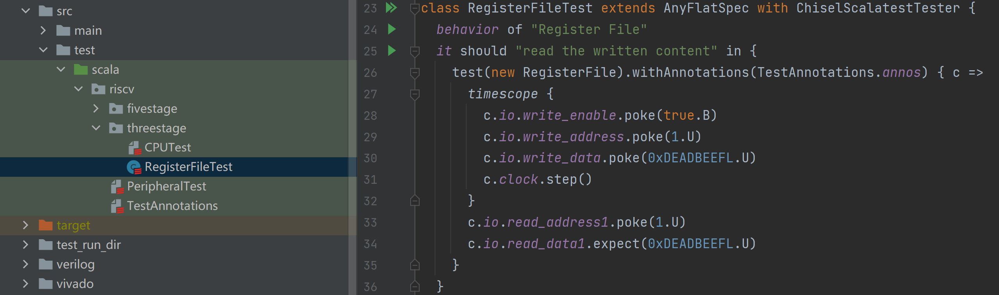
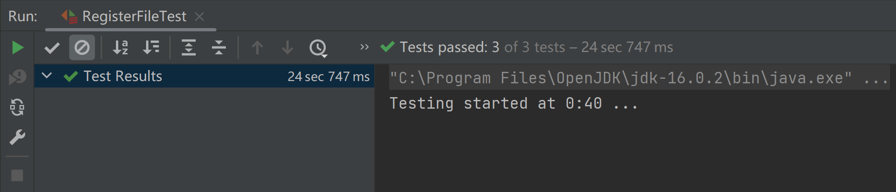

# 快速测试

By: [:material-github: wu-kan](https://github.com/wu-kan)

## IDE 操作

以 Intellij IDEA IDE 为例，打开 `src/test` 目录下任意一个测试，在右边的代码编辑区域，在一些代码行的左边会显示绿色三角形图标，单击即可运行测试。



测试结果会显示在窗口下方，如果有测试不通过也是正常的：



## 命令行操作

在项目目录执行下述指令可以模拟运行本项目的测试，首次运行时需要联网自动下载必要的组件。

```bash
sbt test
```

如果要运行单个测试，比如只运行 InsturctionDecoderTest，执行下面命令。

```
sbt "testOnly riscv.singlecycle.InstructionDecoderTest"
```
S
???+tips "设置代理"s
    如果下载失败或者网络不稳定，可以尝试设置代理。请根据自己的实际情况填写代理地址。
    ```bash
    export HTTPS_PROXY=http://127.0.0.1:1080
    export JAVA_OPTS="$JAVA_OPTS -Dhttps.proxyHost=127.0.0.1 -Dhttps.proxyPort=1080"
    ```
???+tips "使用 Verilator 加速测试"
    如果测试运行太慢，可以[安装 Verilator 加速测试](./environment.md#%E5%AE%89%E8%A3%85-verilator%E5%8F%AF%E9%80%89)。

如果成功执行，你会看到类似这样的输出。

```bash
[success] Total time: 385 s (06:25), completed Dec 15, 2021, 8:45:25 PM
```
