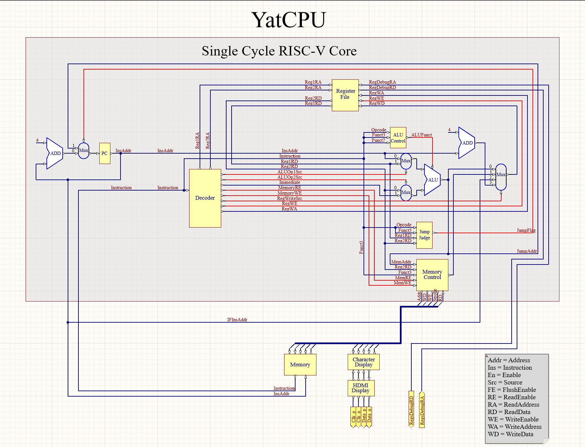

# 实验一 单周期 CPU

单周期CPU一条指令的执行在一个时钟周期内完成。由于时钟周期是固定的，所以执行所有指令都必须和执行最慢指令耗费一样的时间。单周期cpu性能是最差的，实现起来则是最简单的。

在本实验中，我们先向大家展示单周期cpu的结构，然后会结合代码细致说明指令执行的步骤（期间会留有填写代码的任务，请记得完成）。


## 单周期cpu结构图

数据通路用蓝线标识，控制信号用红线标识。线路和模块的命名和代码有差异。



## 数据通路（datapath） 

数据在功能部件之间传送的路径称为数据通路。路径上执行必要功能的部件称为数据通路部件，如ALU、通用寄存器、内存等。

数据通路显示了数据从一个组件流向另一个组件的所有方式。

## 控制信号（control signal）

顾名思义，控制信号控制数据通路。每当有决定要做出时，控制器就必须做出正确的决定并将控制信号发给相应的数据通路部件。例如：alu是进行加法还是减法？我们是要从内存中读取还是写入？

那么控制器如何弄清楚需要做什么呢？这完全取决于我们正在执行的指令。在RISC-V指令格式中，控制器通过指令的opcode、funct3、funct7字段得知该做出什么决定，从而发出正确的控制信号。

cpu原理图中的Decoder、ALUControl、JumpJudge三个原件都可以看作控制器。他们接收指令并输出控制信号。

控制信号引导数据通过数据路径，以便指令正确执行。


## 执行指令的步骤

一般来说执行一条指令最多需要五个步骤：

- 取指：从内存中获取指令数据。
- 译码：弄清楚这条指令的意义，并读取寄存器数据。
- 执行：用ALU计算结果。
- 访存（load/store指令）：读写内存。
- 回写（部分指令）：将结果写回寄存器。

下面我们结合代码对每个步骤进行分析。(下面涉及的代码都位于 `lab1/src/main/scala/riscv` 目录下)

### 取指 

代码位于 `core/InstructionFetch.scala`

取指阶段，在时钟上升沿到来时pc寄存器的值发生变化，从而在内存中读出下一条指令。

```
val pc = RegInit(ProgramCounter.EntryAddress)
```
首先pc寄存器的值被初始化为程序的入口地址。

```
when(io.instruction_valid) {
  when(io.jump_flag_id){
    pc := io.jump_address_id
  }.otherwise {
    pc := pc + 4.U
  }
  io.instruction := io.instruction_read_data
}.otherwise{
  pc := pc
  io.instruction := 0x00000013.U
}
io.instruction_address := pc
```

指令有效时，如果需要跳转则pc指向跳转地址，否则pc+4（指向下一条指令）。

值得注意的是，如果没有pc寄存器的话就无法利用时钟驱动指令的执行。

???+tips "clk"
    chisel 3每个模块都有一个隐藏的时钟信号，模块中的每个寄存器都使用这个时钟信号


## 译码

代码位于 `core/InstructionDecode.scala`

译码阶段要做的是翻译指令，输出控制信号、读取寄存器操作数以及立即数。

下面以 ex_aluop1_source 控制信号为例。该控制信号控制ALU的第一个操作数的输入。当ex_aluop1_source为0时，ALU的第一个操作数为rs1寄存器的值。当ex_aluop1_source为1时，ALU的第一个操作数为指令地址。

```
io.ex_aluop1_source := Mux(
  opcode === Instructions.auipc || opcode === InstructionTypes.B || opcode === Instructions.jal,
  ALUOp1Source.InstructionAddress,  
  ALUOp1Source.Register
)
```
上面的代码表示，当指令的opcode字段显示该指令属于Btype，或者该指令是jal，又或者该指令是auipc时，将ex_aluop1_source赋值为1(ALUOp1Source.InstructionAddress)。否则赋值为0(ALUOp1Source.Register)。

可见译码单元的设计也是很简单的组合逻辑，下面请同学们补充为 `ex_aluop1_source`、`io.memory_read_enable`、`io.memory_write_enable`、`io.wb_reg_write_source` 四个控制信号赋值的代码。

> 任务：请在`core/InstructionDecode.scala` 的 `// lab1 InstructionDecode` 注释处填入代码，使其能通过 `InstructionDecoderTest`


## 执行

代码位于 `core/Execute.scala` 

执行阶段，进行ALU计算并判断是否跳转

```
val alu = Module(new ALU)
val alu_ctrl = Module(new ALUControl)
```
上面的代码在Execute模块内实例化了ALU和ALUcontrol。下面请同学们在Execute模块内为ALU的输入端口赋值。（ALU的代码位于core/ALU.scala）

> 任务：请在`core/Execute.scala` 的 `// lab1 Execute` 注释处填入代码，使其能通过 `ExecuteTest`


## 访存

代码位于 `core/MemoryAccess.scala`

访存阶段


## 写回


从cpu结构图中容易看出，当


## 任务


## 程序计数器

首先我们来实现 CPU 中最简单的部件之一，程序计数器（Program Counter, PC）。在单周期 CPU 中，程序计数器在每一个周期只需要将当前指令地址 +4 （RISC-V 非变长指令长度），并将结果写入寄存器中保存并输出即可。另外，为了处理分支命令，我们还需要接收控制单元送入的跳转信号以及跳转地址，如果跳转信号使能，我们就需要将跳转目的地址写入寄存器中。

模块的输入信号以及输出信号已经定义好，相关代码文件位于 `src/main/scala/riscv/core/ProgramCounter.scala`，请在 `// Lab1(ProgramCounter)` 注释处填入代码，使其能通过 `ProgramCounterTest` 测试。

## 寄存器堆

CPU 在进行运算时，需要将结果或状态临时保存在寄存器中。通常，CPU 含有一定数量的通用寄存器（General Purpose Registers, GPR），这些寄存器组合在一起成为寄存器堆（Register File），我们可以给每个寄存器分配一个编号作为寄存器地址，并通过这个编号访问指定的寄存器。RISC-V 中规定的 GPR 有 32 个，编号分别为 0-31，其中 0 号寄存器永远返回 0 值。

寄存器堆提供两个读端口（对应两个源操作数）以及一个写端口（对应一个目的寄存器），每个读端口可以输入寄存器地址并输出对应寄存器数据。写端口输入寄存器地址、写使能信号以及写入数据，如果写使能信号激活，就将写入数据写入寄存器中，否则不进行操作。需要特别注意的是，如果一个寄存器，在同一个周期，既作为源操作数，又作为目的寄存器，则需要通过**转发**的方法，将写入端口的数据输出。

模块的输入信号以及输出信号已经定义好，相关代码文件位于 `src/main/scala/riscv/core/RegisterFile.scala`，请在 `// Lab1(RegisterFile)` 注释处填入代码，使其能通过 `RegisterFileTest` 测试。

## 译码器

当指令从存储器取出后，需要译码器将指令译码，输出适当的控制信号。译码器负责按照指令格式通过纯组合逻辑的方法，解码出对应的控制信号、操作数等信息，并输出。

模块的输入信号以及输出信号已经定义好，相关代码文件位于 `src/main/scala/riscv/core/InstructionDecode.scala`，请在 `// Lab1(InstructionDecode)` 注释处填入代码，使其能通过 `InstructionDecodeTest` 测试。

## ALU

在执行阶段，ALU 负责计算并将结果输出，为纯组合逻辑。

模块的输入信号以及输出信号已经定义好，相关代码文件位于 `src/main/scala/riscv/core/ALU.scala`，请在 `// Lab1(ALU)` 注释处填入代码，使其能通过 `ALUTest` 测试。

## 提交 Autograder

完成以上所有实验并通过相应测试后，请将以下文件打包为 `.zip` 文件，并上传到 Autograder 进行进一步的测试：

- `src/main/scala/riscv/core/ProgramCounter.scala`
- `src/main/scala/riscv/core/InstructionDecode.scala`
- `src/main/scala/riscv/core/RegisterFile.scala`
- `src/main/scala/riscv/core/ALU.scala`

请确保 Autograder 提交界面显示的完整文件路径包含上述文件路径且完全一致。多余的文件可以上传但将被忽略。


