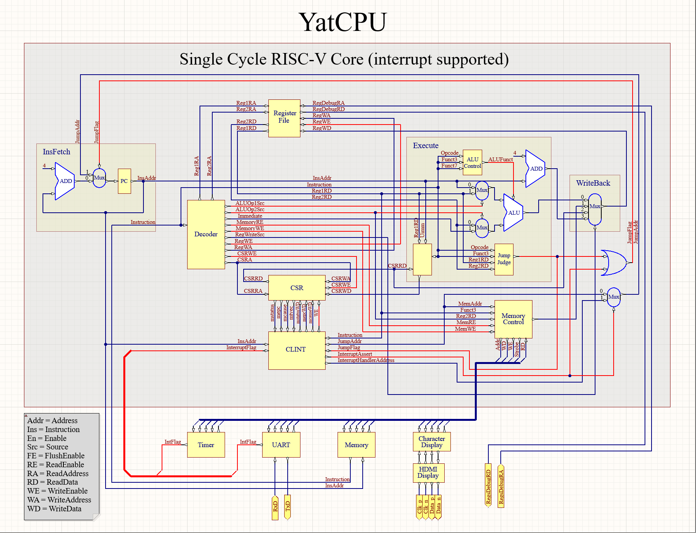

# 中断

[//]: # (完成流水线 CPU 实验后，你就已经对基于流水线 CPU 的原理和设计有初步认识了。但是这个简单的 CPU 只能按照预先的程序指令一直运行，无法中途打断。然而，我们生活的世界充满了不确定性，一个实用的 CPU 需要能够时刻准备好处理来自外部的事件，及时处理中断，并返回到原来的程序中继续执行。)

完成单周期 CPU 实验后，你获得了一个可以简单的按照预期指令执行的处理器。但是这个简单的 CPU 只能按照预先的程序指令一直运行，无法中途打断。然而，我们生活的世界充满了不确定性，一个实用的 CPU 需要能够时刻准备好处理来自外部的事件，及时处理中断，并返回到原来的程序中继续执行。

在本实验中，你将学习到：

- CSR 寄存器以及其操作命令
- 中断控制器的原理和设计
- 编写一个简单的定时中断发生器

## CSR寄存器的操作命令

从预备知识[中断与异常](../tutorial/interrupt-and-exception.md)我们已经学习到了CSR寄存器的基本概念。本实验里我们在单周期CPU的基础上增加对CSR寄存器的操作指令的支持。

CSR相关操作指令集的细节，包括指令的语义，编码等，都可以通过阅读[非特权集手册](https://github.com/riscv/riscv-isa-manual/releases/download/Ratified-IMAFDQC/riscv-spec-20191213.pdf)的第九章获得。
中断相关的具体CSR寄存器的内容与对应含义，请查阅[特权级手册](https://github.com/riscv/riscv-isa-manual/releases/download/Priv-v1.12/riscv-privileged-20211203.pdf)

有了实现单周期CPU的经验，我们可以把对CSR指令的支持分解为：

- **CSR 寄存器组**：CSR 寄存器是一组类似于 RegisterFile 寄存器组的，地址空间大小为 4096 字节，独立编址的寄存器。
   从指令手册可以看到对CSR寄存器的操作都是原子读写的，CSR指令具体的语义请查阅手册。
   CSR寄存器组需要根据ID模块译码后给出的控制信号和CSR寄存器地址，来对内部寄存器进行寻址，获取其内容并且修改。
- **ID 译码单元**：ID 译码单元需要识别 CSR 指令，根据手册里描述的指令语义和编码规范，产生相应的传给其它模块的控制信号与数据。
- **EX 执行单元**：CSR 指令都是原子读写的，即一条指令的执行结果中，既要把目标 CSR 寄存器原来的内容写入到目标通用寄存器中，还要按指令语义把从目标 CSR 寄存器读出来的内容修改之后再写回给该CSR 寄存器。此时 EX 里面的 ALU 单元是空闲的，要得到写入 CSR 寄存器的值，可以复用 ALU，也可以不复用。
- **WB 写回单元**：支持 CSR 相关操作指令后，写回到目标通用寄存器的数据来源就多了一个从目标 CSR 寄存器读出来的修改前的值。

## 中断控制器（CLINT）

简单来说，中断控制器要完成的任务就是检测外部中断，在中断到来并且中断使能时，会中断 CPU 目前的执行流，设置好相关 CSR 寄存器信息后跳转到中断处理程序中执行中断处理程序。

关键就是该保存哪些信息到对应的CSR寄存器中，答案就是 CPU 执行完当前指令后的下一个状态。比如当前指令是跳转指令，那么 `mepc` 保存的应该是当前跳转指令的跳转目标地址。

还有一些特殊情况。我们知道外部中断使能由 `mstatus` 内容决定，那么要思考如果当前指令如果是修改 `mstatus` 执行结果是关中断的指令执行时，外部中断到来了，那么下个周期是否应该响应中断？
为了统一起见，我们认为这种情况不应该响应中断，并且我们认为应该让当前指令执行完后，再跳转到中断处理程序。

### 响应（硬件）中断

响应中断具体分为两部分：

首先获取CPU下一个状态的信息，然后一个周期内把相应的内容写入到相应的寄存器。具体内容为：
   
- `mepc`：保存的是中断或者异常处理完成后，CPU返回并开始执行的地址。所以对于异常和中断，`mepc` 的保存内容需要注意。
- `mcause`：保存的是导致中断或者异常的原因，具体内容请查阅特权级手册里的相关内容。
- `mstatus`：在响应中断时，需要将 `mstatus` 寄存器中的 `MPIE` 标志位设置为 `0`，禁用中断。 

然后从 `mtvec` 获取中断处理程序的地址，跳转到该地址执行进一步的中断处理。

### （硬件）中断返回

而与响应中断对应的中断处理完成后（`mret`），需要恢复 CPU 执行流程，这时候其实干的事与响应中断是大致相同的，只不过需要写入的寄存器只有 `mstatus`，跳转的目标地址则是从 `mepc` 获取。
对于 `mret` 时 `mstatus` 的要写入的值，我们为了简单起见，就把 MIE 位置为 MPIE 位，那么 MPIE 为 1 的话 `mret` 就会恢复中断，如果 MPIE 为 0 的话，`mret` 则不改变 `mstatus` 的值，这也导致了我们不支持中断嵌套。以后实现特权级切换的时侯，`mstatus` 的改变更为复杂。但是全都在手册中有明确的标准，想进一步了解中断机制的实现可以看特权级手册的 3.1.6.1 小节。

而异常的现场保存和恢复与中断处理差不多，只不过保存和恢复的内容上有所不同而已，感兴趣的同学可以自行摸索。

###  关于CLINT的实现

CLINT 具体的实现方法很多，为了简单起见，我们采用纯组合逻辑实现这个中断控制器。（目前 YatCPU 的主仓库的 CLINT 采用状态机来实现）
由于基于单周期 CPU 且 CLINT 是组合逻辑，所以外部中断到来时，CLINT 会马上响应。

CLINT 需要一个周期就把多个寄存器的内容修改的功能，而正常的 CSR 指令只能对一个寄存器读-修改-写（Read-Modify-Write, RMW）。所以 CLINT 和 CSR 之间有独立的优先级更高的通路，用来快速更新 CSR 寄存器的值。

## 简单的定时中断发生器

我们要实现一个 MMIO 的定时中断发生器——Timer。

MMIO 简单来说就是：该外设用来和 CPU 交互的寄存器是与内存一起编址的，所以 CPU 可以通过访存指令（load/store）来修改这些寄存器的值，从而达到 CPU 和外设交互的目的。

而 MMIO 的实现目前在没有实现总线的情况下，使用多路选择器即可达到目的。原因主要是我们把取指令的操作和 load/store 访存操作分开了，让 Memory 有单独的一个通路进行取指令操作。
因此我们的模型还是一个 CPU 对多个外围设备，不会出现 CPU 的取指操作与访存操作冲突争抢外设的情况。

所以我们CPU发出的逻辑地址要发送到哪个设备，就由逻辑地址的高位作为外围设备的位选信号即可，低位则用于设备内部的寻址。

此外还有定时中断发生器的内部逻辑：两个控制寄存器 `enable` 寄存器和 `limit` 寄存器。

- `enable` 寄存器用来控制定时中断发生器的使能，为 `false` 则不产生中断， 映射到地址空间的逻辑地址为 0x80000008。
- `limit` 寄存器用来控制定时器的中断发生间隔，映射到地址空间的逻辑地址为 0x80000004。中断发生器内部有一个加一计数器，当计数器的值到达 `limit` 为标准的界限时，定时器会发生一次中断信号（`enable` 使能情况下）。注：产生中断信号的时长没有太大关系，但是至少应该大于一个 CPU 时钟周期，确保 CPU 能够正确捕捉到该信号即可。

## 实验任务

1. EX 执行单元在处理 CSR 指令时能够正确地得到写入 CSR 寄存器的数据。
2. CSR 寄存器组可以正确支持CLINT和来自CSR指令的读写操作。
3. 定时中断发生器可以正确产生中断信号，并且实现 Timer 寄存器的 MMIO。
4. CLINT 能够正确的响应中断并且在中断结束后回到原来的执行流。

EX 执行单元的代码文件位于 `src/main/scala/riscv/core/Execute.scala`

CSR 寄存器组的代码文件位于 `src/main/scala/riscv/core/CSR.scala`

CLINT 的代码文件位于 `src/main/scala/riscv/core/CLINT.scala`

Timer 的代码位于 `src/main/scala/riscv/peripheral/Timer.scala`

在上面提到的 EX、CSR、CLINT、Timer 四个单元的相应文件里面，请在 `// lab2(CLINTCSR)` 注释处填入相应的代码，使其能够通过 `CPUTest`、`ExecuteTest`、`CLINTCSRTest`、`TimerTest` 测试。

如果能够正确完成本次实验，那么你的 CPU 就可以运行更加复杂的程序了，可以运行一下俄罗斯方块程序试试，如果想要上手玩的话，也许需要一个串口转接板，这样就可以通过电脑的键盘通过 UART 串口给程序输入字符了。

## CPU架构图

