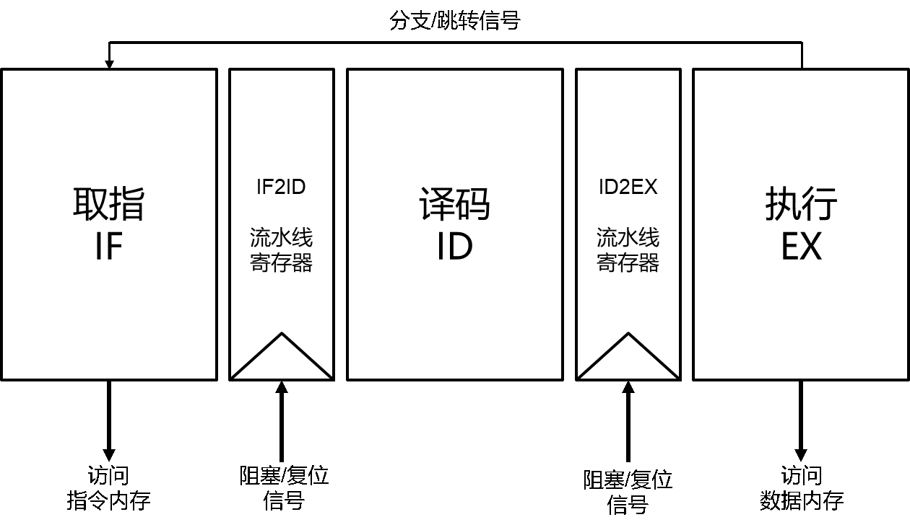
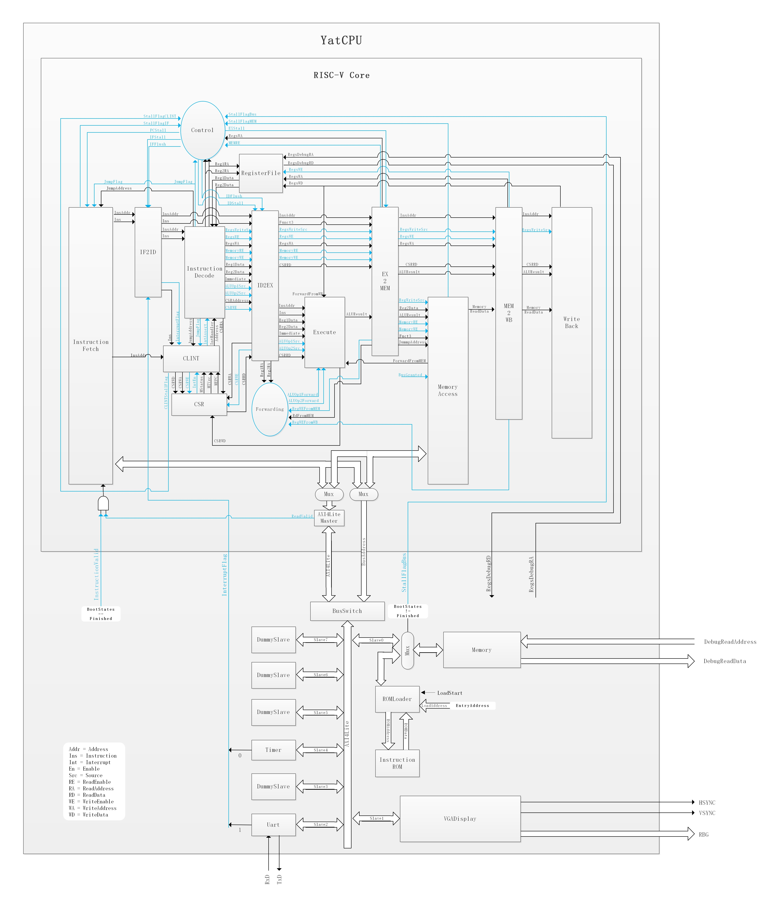

# 处理器架构

By: [:material-github: howardlau1999](https://github.com/howardlau1999)

## 微架构

本项目支持的指令集是 [RISC-V](https://riscv.org/) 的 RV32I 整数运算指令集。微架构设计上，有两种可供选择：一种是和 [Z-scale](https://github.com/ucb-bar/zscale) 以及 [riscv-mini](https://github.com/ucb-bar/riscv-mini) 类似的三级流水线单发射顺序执行架构，另一种是和《Computer Organization and Design, RISC-V edition》中描述的 CPU 类似的五级流水线单发射顺序执行架构。

### 三级流水线

流水线总体架构分为取指（IF）、译码（DE）、执行/写回/访存（EX、WB、MEM）三个阶段，如下图所示：



### 五级流水线

流水线总体架构分为取指（IF）、译码（DE）、执行（EX）、访存（MEM）和写回（WB）五个阶段，如下图所示：



#### 取指（InstructionFetch）

取指单元包含程序计数器（PC）。在每个时钟上升沿，若 PC 阻塞信号 `PCStall` 有效，则 PC 的值保持不变；否则若跳转标志 `JumpFlag` 有效，则 PC 的值变为跳转目标地址 `JumpAddress`；否则 PC 的值加 4。

取指阶段根据 PC 的值通过 AXI4Lite 总线从内存中读取指令并将指令和地址向后传递。由于 CPU 复位时将指令从 ROM 载入内存、通过总线从内存读取每条指令都需要若干时钟周期，在指令未就绪期间，它向后传递空指令 `nop`，并且阻塞 PC（令 `StallFlagIF` 有效）。

#### 译码（InstructionDecode）

译码单元根据指令产生控制信号、拓展立即数并且从寄存器堆或 CSR 读取数据。另外，为了减少跳转指令的代价，将分支指令的判断提前到译码阶段，并且在本阶段向取指单元传递跳转目标地址 `JumpAddress` 和跳转控制 `JumpFlag`。译码单元对中断信号的处理可以视为在原本处理的指令之上“叠加了一条无条件跳转指令”：若 `IntAssert` 信号有效，则将 `JumpAddress` 设为 `IntHandlerAddress`，且令 `JumpFlag` 有效。

#### 执行（Execute）

执行单元包含 ALU 和 ALUControl。ALUControl 根据指令的 `opcode`、`funct3` 和 `funct7` 字段产生 ALU 控制信号，ALU 根据控制信号 `ALUOp1Src` 和 `ALUOp2Src` 对两个操作数进行相应的运算。ALU 的操作数 1 从寄存器 `rs1` 数据 `Reg1Data`、指令地址 `InsAddr`、来自访存单元的转发 `ForwardFromMEM` 和来自写回单元的转发 `ForwardFromWB` 中选取；ALU 的操作数 2 从寄存器 `rs2` 数据 `Reg2Data`、立即数 `Immediate`、来自访存单元的转发 `ForwardFromMEM` 和来自写回单元的转发 `ForwardFromWB` 中选取。对于读写 CSR 的指令，在执行阶段还有对 CSR 的写入。

#### 访存（MemoryAccess）

对于 `load` 或 `store` 指令，访存单元根据存储器读使能 `MemoryRE` 和存储器写使能 `MemoryWE` 通过 AXI4Lite 总线对内存进行读或写，在总线通信期间需要阻塞流水线（令 `StallFlagMEM` 有效）。另外，访存单元还要产生转发给执行单元的数据 `ForwardFromMEM`。

#### 写回（WriteBack）

写回单元根据控制信号 `RegsWriteSrc` 从 ALU 运算结果 `ALUResult`、内存读取的数据 `MemoryReadData`、CSR 读取的数据 `CSRRD`、当前指令地址 `InsAddr` +4 中选择写回寄存器堆的数据 `RegsWD`，这个数据也作为转发给执行单元的数据 `ForwardFromWB`。

#### 流水线寄存器（XX2XX）

流水线寄存器位于两个流水级之间，用于暂存数据和控制信号。有两个信号用于控制流水线寄存器：当 `XXStall` 为高电平时，该级流水线寄存器的值不变；当 `XXFlush` 为高电平时，该级流水线寄存器的值清零；当这两个信号都为低电平时，流水线寄存器在时钟上升沿锁存输入值。

#### 转发（Forwarding）

转发单元根据执行单元、访存单元和写回单元的控制信号判断是否需要将访存单元或写回单元的数据转发到执行单元，判断过程可以用伪代码描述如下：

```
if (RegWEFromMEM && RdFromMEM != 0 && RdFromMEM == Reg1RA) {
    ALUOp1Forward = ForwardingType.ForwardFromMEM
} else if (RegWEFromWB && RdFromWB != 0 && RdFromWB == Reg1RA) {
    ALUOp1Forward = ForwardingType.ForwardFromWB
} else {
    ALUOp1Forward = ForwardingType.NoForward
}

if (RegWEFromMEM && RdFromMEM != 0 && RdFromMEM == Reg2RA) {
    ALUOp2Forward = ForwardingType.ForwardFromMEM
} else if (RegWEFromWB && RdFromWB != 0 && RdFromWB == Reg2RA) {
    ALUOp2Forward = ForwardingType.ForwardFromWB
} else {
    ALUOp2Forward = ForwardingType.NoForward
}
```

通过转发可以解决执行单元处理的指令的源操作数是前两条指令的 ALU 运算结果或前面第二条指令的访存结果而产生的数据冒险。若本条指令的源操作数是上一条指令的访存结果，无法通过转发消除数据冒险，需要将流水线阻塞一个时钟周期，由下文叙述的控制单元进行检测和处理。

#### 控制（Control）

控制单元接收来自 PC、取指单元、译码单元和执行单元的阻塞请求 `StallFlagXX` 并阻塞相应的流水级。另外，控制单元若检测到执行单元处理的指令的源操作数是上一条指令访存结果，将把流水线阻塞一个时钟周期，并且清除流水线寄存器 ID2EX （`IDFlush`）。对于跳转指令，若 `JumpFlag` 有效，还需清除流水线寄存器 IF2ID（`IFFlush`）。

#### 中断（CLINT）

内核中断控制器 （CLINT）接收来自外设的中断信号 `InterruptFlag`，向控制单元发出阻塞流水线的请求 `StallFlagClint`，并将取指单元中当前 PC 值 `InsAddr`（若来自译码单元的 `JumpFlag` 有效，则是跳转指令的目标地址 `JumpAddress`）保存到 `MEPC`，将中断原因保存到 `MCAUSE`，修改 `MSTATUS`；然后向译码单元发送中断信号 `IntAssert` 和中断处理程序地址 `IntHandlerAddress`（`mtvec` 的值）。如上文所述，译码单元接收到 `IntAssert` 和 `IntHandlerAddress` 后会向取指单元传递跳转信号和跳转地址。这样，位于译码、执行、访存、写回阶段的指令继续正常执行，取指单元取出的指令将被清除，PC 被设置为中断服务程序入口地址，下面将开始执行中断服务程序。

内核中断控制器还会检测当前正在译码的指令，若该指令为 `ecall` 或 `ebreak` 则引发一次异常，处理流程与中断类似；若该指令为 `mret`（即从中断或异常处理程序中返回），则修改 `mstatus`，然后将 `mepc` 的值作为“中断处理程序地址 `IntHandlerAddress`” 和“中断信号 `IntAssert`” 传递给译码单元，巧妙地利用进入中断的形式退出中断。

## 访存模型

除寄存器堆以外，本项目默认外部存储设备为**同步读写**模式，也就是只有在时钟上升沿到来时数据才会发生变化，因此所有访存指令都需要提前一个时钟周期发出地址信号，并最快在下一个时钟周期取得数据。

同时，本项目采用冯·诺伊曼架构，也就是指令与数据存放在同一个存储器中，使用相同的地址空间。