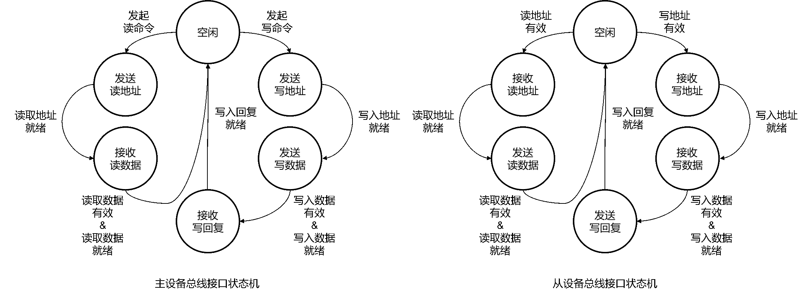

# 总线

By: [:material-github: howardlau1999](https://github.com/howardlau1999)

## 简介

CPU 和其他设备如果想要通信，那么就要和其他设备在物理上连接起来。如果每个设备都像内存一样，需要修改 CPU 的设计和 IO 端口才能连接，那么假如有 m 种 CPU 和 n 种外设，复杂度将成为 O(mn)，不仅每个 CPU 都要适配所有的外设，而且还要把所有的外设都适配到所有 CPU 上，这样的复杂度是不现实的，同时也不灵活。这时，我们就得想到计算机科学的一条“金科玉律”：

> Any problem in computer science can be solved with another level of indirection. [^1]

[^1]: <http://bwlampson.site/Slides/TuringLecture.htm>

既然直接连接起来不现实，那么我们就通过引入一个通用的中间层，让大家都连接到这个中间层，不就把复杂度变为 O(m + n) 了吗？人们觉得这个想法不错，并给这种技术起了一个形象的名字：总线（Bus）。正如它的英文所展示的一样，数据不再是直接在 CPU 和外设间传递，而是先搭上总线这个“公交车”，到达目的地之后再“下车”。

当然，任何的额外的间接层都是有代价的，引入总线有两个问题需要解决：

1. 数据怎么知道它的目的地是哪里？
2. 好几个设备都想同时发送数据，然而总线只允许一个设备发送，要如何仲裁？

而且，作为一层通信协议，各家设备厂商都想设计一套最适合自己设备的协议，于是，总线协议也是百花齐放，有 PCI-e、I2C、USB、AXI 等等……不同总线协议也有不同的使用场景，应当支持哪些协议也是一个需要权衡的问题。

## 总线通信协议

通常而言，总线在传输数据的时候，在保证总线没有被其他设备占用后，发起通信的一方会先发送控制信号，表明接下来传输的数据的设备地址和长度等，目标设备在收到控制信号后，就开始数据的传输过程。

本项目中使用的总线协议是 AXI4-Lite，是由 ARM 公司提出的总线通信协议。它的读写的流程如下图所示：

左图是主设备发起的读流程，右图是主设备发起的写流程。相比起读流程，写流程多了一个写的回复响应，这是因为从设备内部可能有缓冲区，在数据真正写入完成之前，从设备可以不发送响应信号，从而保证数据的完整性。

连接到总线的是总线协议接口，内部实现了状态机。主设备的接口接收来自设备的信号，并主动发起读写请求，而从设备被动地接收主设备发起的请求，并在操作进行的时候通知设备，让设备对读写请求作出相应的逻辑操作。在通信过程中，双方使用状态机来记录一个读写请求的进行状态，并在有效/就绪信号同时置位的时候进行状态转换。

左图是主设备总线接口的状态机，右图是从设备总线接口的状态机。

## 总线仲裁

由于总线是多个设备共享的，如果多个设备同时发起通信，那么信号会产生冲突，导致传输过程无法正常进行。为了避免冲突的发生，所有设备在通信之前，都应该检测总线是否占用。

为此，每一个设备则需要增加总线请求线以及总线授权线，连接到总线仲裁器。在设备需要通过总线传输数据前，需要先通过总线请求线请求总线的访问权限。总线仲裁器则通过总线授权线来授予访问权限，从而避免设备之间的冲突。

## 总线交换机

由于总线仲裁的方法可能会导致一些设备长时间的等待，总线也可以使用类似网络交换机的方式连接，不同对的设备之间可以通过交换机同时进行通信。